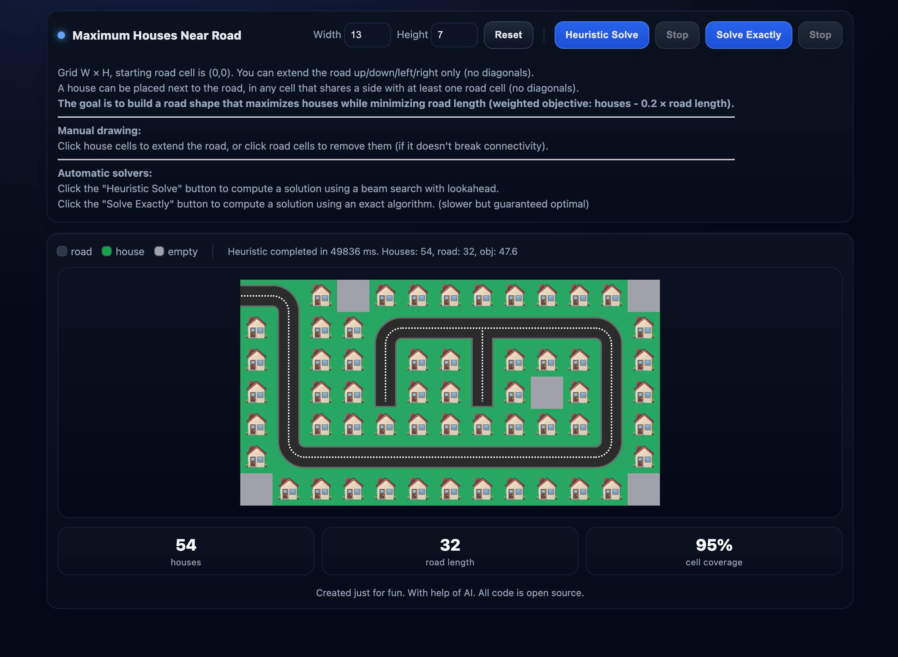

# Maximum Houses Near Road - Interactive Grid Tool

An interactive web application for solving the optimal road placement problem to maximize the number of houses that can be built adjacent to the road.

🎮 **[Demo](https://fl0p.github.io/road/)**

## Problem Description

Given a rectangular grid of W × H cells, the goal is to design a road layout that maximizes the number of houses that can be placed on the grid while minimizing road length.

**Objective Function**: Maximize houses count while minimizing road length (houses - 0.2 × road)

**Constraints**:
- **Road connectivity**: The road must form a single connected component (4-connected, no diagonals)
- **Starting position**: The road always starts at position (0,0)
- **House placement**: Houses can only be placed in cells that are adjacent to at least one road cell (4-connected, no diagonals)  
- **No overlap**: Houses cannot be placed on road cells
- **2×2 restriction**: Road cannot form solid 2×2 blocks (exact solver constraint)

## Features

### Manual Road Drawing
- **Click to extend**: Click on empty cells adjacent to existing road to extend the road
- **Click to remove**: Click on road cells to remove them (only if it doesn't break road connectivity)
- **Visual hints**: 
  - Green glow indicates cells where road can be added
  - Orange glow indicates road cells that can be removed
  - Blue glow on hover for all interactive cells
- **Coverage visualization**: Real-time display of cells that would be covered by houses

### Automatic Optimization
- **Heuristic solver**: Fast beam search with lookahead and multiple restarts for good solutions
- **Exact solver**: DFS-based Branch-and-bound algorithm with memoization to find provably optimal solutions
- **Real-time progress**: Shows search progress, nodes explored, and current best solution
- **Weighted objective**: Optimizes houses - 0.2 × road length for balanced solutions
- **Web Workers**: Non-blocking computation keeps UI responsive during optimization

### Interactive Interface
- **Adjustable grid size**: 2×2 to 15×15 grids
- **Live statistics**: 
  - Number of houses
  - Road length
  - Cell coverage percentage
  - Search nodes explored
  - Weighted objective value
- **Visual feedback**: Real-time updates of covered areas and house placements
- **Modern UI**: Dark theme with smooth animations and visual indicators

## How to Use

1. **Set grid dimensions**: Adjust width and height (2-15 cells each)
2. **Manual drawing**: Click adjacent cells to build your road layout, or click road cells to remove them
3. **Heuristic solving**: Use "Heuristic Solve" for fast, good solutions
4. **Exact solving**: Use "Solve Exactly" for guaranteed optimal solutions (may take longer on larger grids)
5. **Stop solving**: Use "Stop" buttons to cancel running solvers
6. **Reset**: Clear the grid and start over with the current dimensions

## Technical Details

- **State representation**: Uses BigInt bitsets for efficient grid state encoding
- **Connectivity check**: BFS-based algorithm ensures road remains connected when removing cells
- **Heuristic optimization**: Beam search with lookahead, multiple restarts, and center-biased ordering  
- **Exact optimization**: Branch-and-bound with memoization, upper bound pruning, and symmetry breaking
- **Performance**: Web Workers for non-blocking computation, real-time progress updates
- **Constraints**: Prevents 2×2 road blocks in exact solver for more interesting solutions

## File Structure

- `index.html` - Complete standalone application (HTML + CSS + JavaScript)

## Running the Application

Simply open `index.html` in any modern web browser. No additional dependencies or server setup required.

Alternatively, visit the [online demo](https://fl0p.github.io/road/).

## Example Use Cases

- **Educational**: Understanding graph connectivity and optimization problems
- **Research**: Testing different road layout strategies and optimization approaches
- **Game design**: Prototype for city-building or puzzle game mechanics
- **Algorithm comparison**: Benchmarking heuristic vs exact solution methods
- **Competitive programming**: Practice with graph algorithms and state space search
